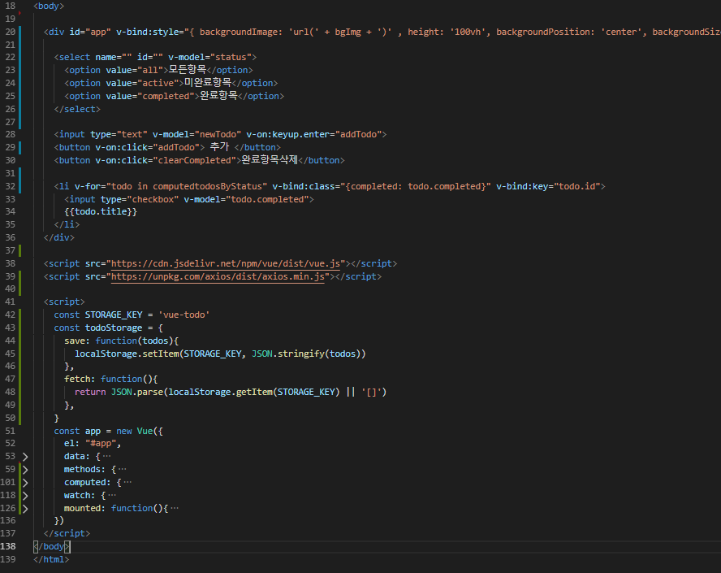

# 20191105_Vue_Intro

함수는 변수에 저장 가능하다!

```js
const asdf = function(){} === function asdf(){}
두 코드는 서로 같다.

```

함수를 변수처럼 쓸 수 있다.

```
localStorage.setItem('test', '123123') => 추가와 수정이 가능(같은 키값이 있으면 수정이고, 다른 키값이면 추가)
반대는 localStorage.getItem()
```


> // 이 주석처리 전체 다 하고 싶은데 어떻게 하냐
>
> 


- 뭔가 좀 이상함.

```html
<!DOCTYPE html>
<html lang="en">
<head>
  <meta charset="UTF-8">
  <meta name="viewport" content="width=device-width, initial-scale=1.0">
  <meta http-equiv="X-UA-Compatible" content="ie=edge">
  <title>Document</title>
  <style>
    .completed {
      text-decoration: line-through;
      opacity: 0.6;
    }
  </style>
</head>
<body>
  <div id="app">
    <!-- <div v-bind:style="{color: color, fontSize: fontSize + 'px'}">
    </div> -->
    <select name="" id="" v-model="status">
      <option value="all">모든 항목</option>
      <option value="active">미완료항목</option>
      <option value="completed">완료항목</option>
    </select>
    <!-- input태그만 양방향 바인딩이 가능???? -->
    <input type="text" v-model="newTodo" v-on:keyup.enter="addTodo">
    <button v-on:click="addTodo"> + </button>
    <button v-on:click="clearCompleted">완료항목삭제</button>
    <!-- event를 추가하기 : v-on:click="todo.completed = true" 이렇게 설정하면, 완료되지 않은 값을 눌렀을 때
      true가 되며 완료가 됨을 표시한다. -->
      <!-- <li v-for="todo in todos" v-if="!todo.completed" v-on:click="check(todo)"> -->
        <!-- v-if="!todo.completed"는 false값을 가진 아이들만 출력! 반대로 !를 없애면 true값을 가진 애만 출력 -->
        <!-- v-for 먼저 돌고 v-if가 나중에 돌며 같이 쓰는 것을 권장하지 않기 때문에 되도록 같이 쓰지 말 것! -->
        <!-- {{todo.title}} -->
       <!-- {{todo.completed}} -->
    <!-- </li> -->
    <!-- <li v-else="" v-on:click="check(todo)">
      {{todo.title}} >> 완료!!
    </li> -->
    <li v-for="todo in computedtodosByStatus" v-bind:class="{completed: todo.completed}" v-bind:key="todo.id">
      <input type="checkbox" v-model="todo.completed">
      {{todo.title}}
    </li>
    <!-- <p>{{dateMethod()}}</p>
    <p>{{dateComputed}}</p> -->
    <!-- <p>{{reverseNewTodo}}</p> -->
  </div>
  <script src="https://cdn.jsdelivr.net/npm/vue/dist/vue.js"></script>
  <script>
    const STORAGE_KEY = 'vue-todo'
    const todoStorage = {
      save: function(todos){
        localStorage.setItem(STORAGE_KEY, JSON.stringify(todos))
      },
      fetch: function(){
        return JSON.parse(localStorage.getItem(STORAGE_KEY))
      },
    }
    const app = new Vue({
      el: "#app",
      data: {
        // color: 'red',
        // fontSize: 30,
        newTodo: '',
        status: 'all',
        todos: [],
        // todos: [
        //  {
        //    id: 1,
        //    title: '점심먹기',
        //    completed: true,
        //  },
        //  {
        //    id: 2,
        //    title: '뷰 공부하기',
        //    completed: false,
        //  },
          // '점심먹기', //이건 그냥 스트링 집어 넣었는데 위의 방법은 배열 안에 오브젝트({})를 만들어서 내용을 넣어줌.
          // '뷰 공부하기',
          // '파이썬 공부하기',
          // '낮잠자기',
          // 데이터를 추가하고 싶다면 app.todos.push('넣고 싶은 내용')
        //  ],
        },
        methods: {
          check: function(todo){
            todo.completed = !todo.completed
          },
          addTodo(){
            console.log(this.newTodo)
            this.todos.push({
              // id: this.id, 이건 안되나?
              id: Date.now(), // 현재 시간을 아이디로 적용
              title: this.newTodo,
              completed: false,
            })
            this.newTodo = ""
          },
          clearCompleted(){
            const notCompletedTodos = this.todos.filter((todo)=>{
              return todo.completed === false
            })
            this.todos = notCompletedTodos
          },
        },
        computed: {
          //reverseNewTodo: function(){
          //  return this.newTodo.split('').reverse().join('')
          //},
          computedtodosByStatus: function() {
            let statusTodos = []
            if (this.status === "completed"){
              statusTodos = this.todos.filter((todo)=>{
                return todo.completed === true
              })
              // 완료된 항목들만 출력
            } else if (this.status === 'active'){
              // 미완료된 항목들만 출력
              statusTodos = this.todos.filter((todo)=>{
                return todo.completed === false
              })
            } else {
              // 전체
              statusTodos = this.todos
            }
            return statusTodos
          },
        },
        watch: {
          todos: {
            handler: function(todos){
              todoStorage.save(todos)
            },
            deep: true
          }
        }
    })
  </script>
</body>
</html>
```


- 수정한 코드

  ```html
  <!DOCTYPE html>
  <html lang="en">
  <head>
    <meta charset="UTF-8">
    <meta name="viewport" content="width=device-width, initial-scale=1.0">
    <meta http-equiv="X-UA-Compatible" content="ie=edge">
    <title>Document</title>
  
    <style>
      .completed {
        text-decoration: line-through;
        opacity: 0.6;
      }
    </style>
  
  </head>
  
  <body>
  
    <div id="app">
      <select name="" id="" v-model="status">
        <option value="all">모든항목</option>
        <option value="active">미완료항목</option>
        <option value="completed">완료항목</option>
      </select>
  
      <input type="text" v-model="newTodo" v-on:keyup.enter="addTodo">
      <button v-on:click="addTodo"> 추가 </button>
      <button v-on:click="clearCompleted">완료항목삭제</button>
  
      <li v-for="todo in computedtodosByStatus" v-bind:class="{completed: todo.completed}" v-bind:key="todo.id">
        <input type="checkbox" v-model="todo.completed">
        {{todo.title}}
      </li>
    </div>
  
    <script src="https://cdn.jsdelivr.net/npm/vue/dist/vue.js"></script>
  
    <script>
      const STORAGE_KEY = 'vue-todo'
      const todoStorage = {
        save: function(todos){
          localStorage.setItem(STORAGE_KEY, JSON.stringify(todos))
        },
        fetch: function(){
          return JSON.parse(localStorage.getItem(STORAGE_KEY))
        },
      }
      const app = new Vue({
        el: "#app",
        data: {
          newTodo: '',
          status: 'all',
          todos: [],
          },
        methods: {
          check: function(todo){
            todo.completed = !todo.completed
          },
          addTodo(){
            console.log(this.newTodo)
            this.todos.push({
              id: Date.now(),
              title: this.newTodo,
              completed: false,
            })
            this.newTodo = ""
          },
          clearCompleted(){
            const notCompletedTodos = this.todos.filter((todo)=>{
              return todo.completed === false
            })
            this.todos = notCompletedTodos
          },
          todosByStatus: function() {
            let statusTodos = []
            if (this.status === "completed"){
              statusTodos = this.todos.filter((todo)=>{
                return todo.completed === true
              })
              // 완료된 항목들만 출력
            } else if (this.status === 'active'){
              // 미완료된 항목들만 출력
              statusTodos = this.todos.filter((todo)=>{
                return todo.completed === false
              })
            } else {
              // 전체
              statusTodos = this.todos
            }
            return statusTodos
          },
          dateMethod: function(){
            return new Date()
          }
        },
        computed: {
          computedtodosByStatus: function() {
            let statusTodos = []
            if (this.status === "completed"){
              statusTodos = this.todos.filter((todo)=>{
                return todo.completed === true
              })
              // 완료된 항목들만 출력
            } else if (this.status === 'active'){
              // 미완료된 항목들만 출력
              statusTodos = this.todos.filter((todo)=>{
                return todo.completed === false
              })
            } else {
              // 전체
              statusTodos = this.todos
            }
            return statusTodos
          },
        },
        watch: {
          todos: {
            handler: function(todos){
              todoStorage.save(todos)
            },
            deep: true
          }
        },
        mounted: function(){
          this.todos = todoStorage.fetch()
        }
      })
    </script>
  </body>
  </html>
  ```


- app의 구조는 이렇게 생겼다.




- 배경화면 설정 및 축약형 사용

```html
<!DOCTYPE html>
<html lang="en">
<head>
  <meta charset="UTF-8">
  <meta name="viewport" content="width=device-width, initial-scale=1.0">
  <meta http-equiv="X-UA-Compatible" content="ie=edge">
  <title>Document</title>

  <style>
    .completed {
      text-decoration: line-through;
      opacity: 0.6;
    }
  </style>

</head>

<body>

  <div id="app" v-bind:style="{ backgroundImage: 'url(' + bgImg + ')' , height: '100vh', backgroundPosition: 'center', backgroundSize: 'cover'}">

    <select name="" id="" v-model="status">
      <option value="all">모든항목</option>
      <option value="active">미완료항목</option>
      <option value="completed">완료항목</option>
    </select>

    <!-- v-on은 @로 나타낼 수 있음 -->
    <input type="text" v-model="newTodo" v-on:keyup.enter="addTodo">
    <button @:click="addTodo"> 추가 </button>
    <button v-on:click="clearCompleted">완료항목삭제</button>

    <!-- v-bind는 :으로 나타낼 수 있음 -->
    <li v-for="todo in computedtodosByStatus" :class="{completed: todo.completed}" v-bind:key="todo.id">
      <input type="checkbox" v-model="todo.completed">
      {{todo.title}}
    </li>

    <span>지금 상태는 {{status}}</span>
    <span v-text="status"></span>
    <span v-html="tag"></span>
    <!-- v-if를 v-show보다 자주 쓰며, v-if는 주석처리되지만, v-show는 dispaly: none;값이 뜬다. -->
    <span v-if="false">안뇨오오오오옹</span>
    <span v-show="false">하이이이</span>

  </div>

  <script src="https://cdn.jsdelivr.net/npm/vue/dist/vue.js"></script>
  <script src="https://unpkg.com/axios/dist/axios.min.js"></script>

  <script>
    const STORAGE_KEY = 'vue-todo'
    const todoStorage = {
      save: function(todos){
        localStorage.setItem(STORAGE_KEY, JSON.stringify(todos))
      },
      fetch: function(){
        return JSON.parse(localStorage.getItem(STORAGE_KEY) || '[]')
      },
    }
    const app = new Vue({
      el: "#app",
      data: {
        newTodo: '',
        status: 'all',
        todos: [],
        bgImg: '',
        tag: '<h1>안녕하세요</h1>',
        },
      methods: {
        check: function(todo){
          todo.completed = !todo.completed
        },
        addTodo(){
          if (this.newTodo.length > 0){
            this.todos.push({
              id: Date.now(),
              title: this.newTodo,
              completed: false,
            })
            this.newTodo = ""
          }
        },
        clearCompleted(){
          const notCompletedTodos = this.todos.filter((todo)=>{
            return todo.completed === false
          })
          this.todos = notCompletedTodos
        },
        todosByStatus: function() {
          let statusTodos = []
          if (this.status === "completed"){
            statusTodos = this.todos.filter((todo)=>{
              return todo.completed === true
            })
            // 완료된 항목들만 출력
          } else if (this.status === 'active'){
            // 미완료된 항목들만 출력
            statusTodos = this.todos.filter((todo)=>{
              return todo.completed === false
            })
          } else {
            // 전체
            statusTodos = this.todos
          }
          return statusTodos
        },
        dateMethod: function(){
          return new Date()
        }
      },
      computed: {
        computedtodosByStatus: function() {
          let statusTodos = []
          if (this.status === "completed"){
            statusTodos = this.todos.filter((todo)=>{
              return todo.completed === true
            })
          } else if (this.status === 'active'){
            statusTodos = this.todos.filter((todo)=>{
              return todo.completed === false
            })
          } else {
            statusTodos = this.todos
          }
          return statusTodos
        },
      },
      watch: {
        todos: {
          handler: function(todos){
            todoStorage.save(todos)
          },
          deep: true
        }
      },
      mounted: function(){
        this.todos = todoStorage.fetch() // null
        const IMG_URL = "https://source.unsplash.com/1600x900/?nature,water"
        axios.get(IMG_URL)
          .then((response)=>{
            console.log(response.request.responseURL)
            this.bgImg = response.request.responseURL
          })
          .catch((error)=>{})
      }
    })
  </script>
</body>
</html>
```

