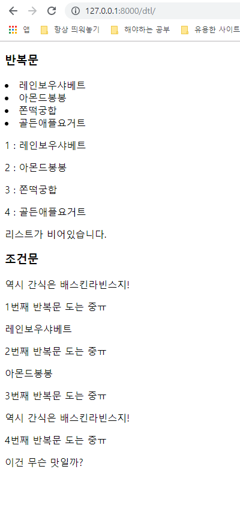

# Django_start

python -m venv venv

venv가(virtual environment) 가상환경 설정이라는데?

source venv/Scripts/activate 설정하면

밑에 (venv)가 따라다님 -- pip list하면 몇 개 없음

deactivate하면 해제 됨  -- pip list하면 원래 pip 리스트가 나옴

원하는 폴더에서 open with code클릭 후 f1 눌러서 select interpreter치고 venv누르면 끝

<<자주 쓸 명령어>>

- django-admin startproject django_intro .

- python manage.py runserver

settings.py, urls.py는 많이 만질 거래

app 만들면 app 등록해야함


- dtl.html

```python
<body>
  <h3>반복문</h3>
  
    <li>{{menu}}</li>
  

  
    <p>{{forloop.counter}} : {{menu}}</p>
   

  
    <p>{{e}}</p>
  
    <p>리스트가 비어있습니다.</p>
  

  <h3>조건문</h3>
  
    <p>역시 간식은 배스킨라빈스지!</p>
  

  
    <p>{{forloop.counter}}번째 반복문 도는 중ㅠ</p>
    
      <p>역시 간식은 배스킨라빈스지!</p>
    
      <p>이건 무슨 맛일까?</p>
    
      <p>{{menu}}</p>
    
  
</body>
```





- 흐엥 어려워ㅜ


# Django_advanced

- scheme는 영화제목, 감독, 상영시간 같이 그에 맞는 데이터를 넣을 수 있도록 도와주는 역할이랄까??

  | 영화제목 | 감독 | 상영시간 |
  | -------- | ---- | -------- |
  | .        | .    | .        |
  | .        | .    | .        |
  | .        | .    | .        |

- Posts > models.py > class 정의하기

  - Post(models.Model)를 만들어!!!!
  - 

- instance생성

  - 변수 = 클래스이름() 이라고 하면 됨.

  - 


