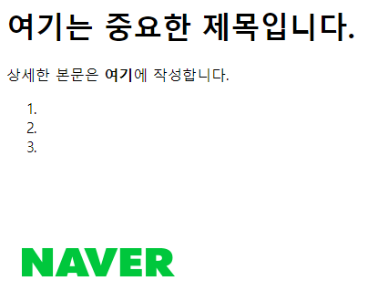
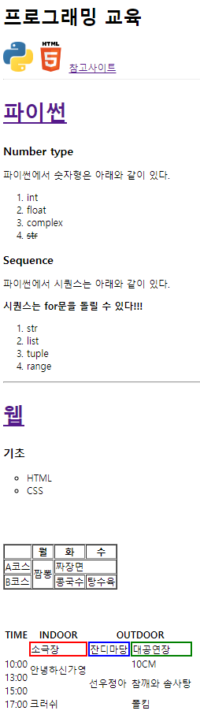

# Web

마크업 = 구조화

이미지 태그는 닫는 태그 없어 그리고 이미지 넣기 위한 태그

태그는 속성

a태그는 닫는 태그 따로 있고 하이퍼텍스트 넣기위한 코드임

싱글쿼트 노노해

속성명이랑 속성값은 띄어쓰기 하지 말자

돔 트리 : 부모-자식관계, 형제관계

모두 다 디비전(div)이잖앙!! 컴터가 어케 알아ㅠㅠ

이건 시맨틱 코드가 아는거야!!

SEO : 검색 엔진 최적화

/<ol> 은 /<li>를 항상 자식으로 둠.

ol>li*3 하고 탭키 누르면 자동완성 됨.

ol은 순서가 있어서 숫자로 표현되고 ul은 순서가 없어서 점으로 표현됨

```html
<hr> 요거요거 안 조아ㅠ
```

> intro.html

```html
<h1>여기는 중요한 제목입니다.</h1>
<!-- <p>상세한 본문을 적고 싶을 때</p> -->
<!-- <b>굵은 글씨로 강조하고 싶을 때</b> -->
<p>상세한 본문은 <b>여기</b>에 작성합니다.</p>

<!-- <ol>ordered list의 약자로, 숫자로 표기 됨.</ol> -->
<!-- <li>li는 ol이나 ul의 자식 관계임.</li> -->
<ol>
    <li></li>
    <li></li>
    <li></li>
</ol>

<a href="https://naver.com">
    
</a>
```



<br>

> index.html

```html
<!DOCTYPE html>
<html lang="en">
<head>
    <meta charset="UTF-8">
    <meta name="viewport" content="width=device-width, initial-scale=1.0">
    <meta http-equiv="X-UA-Compatible" content="ie=edge">
    <title>Document</title>
</head>

<body>
    <h1>프로그래밍 교육</h1>
    <a href="#python"></a>
    <a href="#web"></a>
    <a href="intro.html">참고사이트</a>
    <hr>

    <h2 id="python">
        <a href="https://docs.python.org/ko/3/tutorial/index.html" target="_blank">
            <h2>파이썬</h2>
        </a>
    </h2>

    <h3>Number type</h3>
    <p>파이썬에서 숫자형은 아래와 같이 있다.</p>
    <ol>
        <li>int</li>
        <li>float</li>
        <li>complex</li>
        <li>
            <del>str</del>
        </li>
    </ol>

    <h3>Sequence</h3>
    <p>파이썬에서 시퀀스는 아래와 같이 있다.</p>
    <p>
        <b>시퀀스는 for문을 돌릴 수 있다!!!</b>
    </p>
    <ol>
        <li>str</li>
        <li>list</li>
        <li>tuple</li>
        <li>range</li>
    </ol>
    <hr>

    <h2 id="web">
        <a href="https://developer.mozilla.org/ko/">
            <h2>웹</h2>
        </a>
    </h2>

    <h3>기초</h3>
    <!-- <ul>unordered list의 약자로, 숫자가 아닌 dot으로 표기 됨. style을 바꿀 수도 있음.</ul> -->
    <ul>
        <li style="list-style-type: circle">HTML</li>
        <li style="list-style-type: circle">CSS</li>
    </ul>

    <br>
    <br>
    <br>

    <table border="1">
        <thead>
            <th></th>
            <th>월</th>
            <th>화</th>
            <th>수</th>
        </thead>
        <tbody>
            <tr>
                <td>A코스</td>
                <td rowspan="2">짬뽕</td>
                <td colspan="2">짜장면</td>
            </tr>
            <tr>
                <td>B코스</td>
                <td>콩국수</td>
                <td>탕수육</td>
            </tr>
        </tbody>
    </table>

    <br>
    <br>
    <br>

    <table>
        <thead>
            <th>TIME</th>
            <th>INDOOR</th>
            <th colspan="2">OUTDOOR</th>
        </thead>
        <tbody>
            <tr>
                <td></td>
                <td style="border:2px solid red">소극장</td>
                <td style="border:2px solid blue">잔디마당</td>
                <td style="border:2px solid green">대공연장</td>
            </tr>
            <tr>
                <td>10:00</td>
                <td rowspan="2">안녕하신가영</td>
                <td></td>
                <td>10CM</td>
            </tr>
            <tr>
                <td>13:00</td>
                <td rowspan="2">선우정아</td>
                <td rowspan="2">참깨와 솜사탕</td>
            </tr>
            <tr>
                <td>15:00</td>
                <td></td>
            </tr>
            <tr>
                <td>17:00</td>
                <td>크러쉬</td>
                <td></td>
                <td>폴킴</td>
            </tr>           
        </tbody>
    </table>

    <br>
    <br>
    <br>
    <br>
    <br>
    
</body>
</html>
```

<br>



<br>

> subway.html

```html
<!DOCTYPE html>
<html lang="en">
<head>
    <meta charset="UTF-8">
    <meta name="viewport" content="width=device-width, initial-scale=1.0">
    <meta http-equiv="X-UA-Compatible" content="ie=edge">
    <title>Document</title>
</head>
<body>
    <h1>서브웨이 주문하기</h1>
    <p>주문서를 작성해주세요.</p>

    <!-- form은 데이터를 넣기위한 구분 -->
    <form action="">
        <label for="name">이름:</label>
        <input id="name" type="text" name="name">
        <!-- id와 for는 연결의 의미 -->
        <!-- name : 속성명, "" : 속성값 -->

        <label for="when">날짜:</label>
        <input id="when" type="date" name="when">
        <!-- date는 달력형식으로 날짜를 선택할 수 있음 -->

        <h3>1. 샌드위치 선택</h3>
        <input id="option1" type="radio" name="main" value="1"><label for="option1">에그마요</label>
        <input id="option2" type="radio" name="main" value="2"><label for="option2">비엘티</label>
        <input id="option3" type="radio" name="main" value="3"><label for="option3">터키</label>
        <input type="submit">

        <hr>

        <h3>2. 사이즈 선택</h3>
        <input id="size1" type="radio" name="size" value="15"><label for="size1">15cm</label>
        <input id="size2" type="radio" name="size" value="30"><label for="size2">30cm</label>
        <input type="submit">

        <hr>

        <h3>3. 빵 선택</h3>
        <input type=""><label for="">허니오트</label>
        <input type=""><label for="">플랫브래드</label>
        <input type=""><label for="">하티 이탈리안</label>

        <hr>

        <h3>4. 야채/소스 선택</h3>
        <input id="opt1" type="checkbox"><label for="opt1">토마토(+300원)</label><br>
        <input id="opt2" type="checkbox"><label for="opt2">오이(+300원)</label><br>
        <input id="opt3" type="checkbox"><label for="opt3">할라피뇨(+500원)</label><br>
        <input id="opt4" type="checkbox"><label for="opt4">핫칠리(+500원)</label><br>
        <input id="opt5" type="checkbox"><label for="opt5">바베큐(+700원)</label><br>
    </form>
</body>
</html>
```

